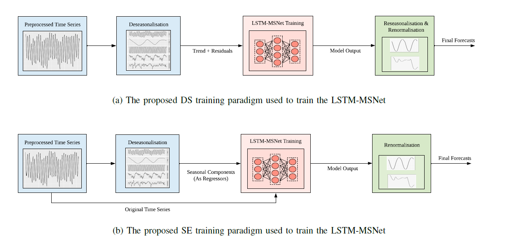

LSTM-MSNet: Leveraging Forecasts on Sets of Related Time Series with Multiple Seasonal Patterns
===================

This page contains the explanation of our **L**ong **S**hort-**T**erm **M**emory **M**ulti-**S**easonal **Net** (LSTM-MSNet) forecasting framework, which can be used to forecast a sets of time series with multiple seasonal patterns.

In the description, we first provide a breif introduction to our methdology, and then explain the steps to be followed to execute our code and use our framework for your research work. 

# Methodology #



The above figure gives an overview of the proposed LSTM-MSNet training paradigms. In the DS approach, deseasonalised time series are used to train the LSTM-MSNet. Here, a reseasonalisation phase is required as the target MW patches are seasonally adjusted. Whereas in the SE approach, the seasonal values extracted from the deseasonalisation phase are employed as exogenous variables, along with the original time series to train the LSTM-MSNet. Here a reseasonalisation phase is not required as the target MW patches contain the original distribution of the time series. A more detailed explaination of these training paradigms can be found in our [manuscript](https://arxiv.org/pdf/1909.04293.pdf). 

We used **DS** and **SE** naming conventions in our code repository to distinguish these training paradigms. Please note that this repo contains seperate preprocessing files for each of these training paradigms. 

**NOTICE**: You may find duplicated code as a result of these two paradigms. However, we expect to refactor this code and provide the training paradigm as a query parameter to our execution scripts. We also expect to migrate this code to Tensorflow 2.0 soon. 

# Usage #

## Software Requirements ##

| Software  | Version |
| ------------- | ------------- |
| `Python`  |  `>=3.6`  |
| `Tensorflow`  | `1.12.0`  |
| `smac`  | `0.8.0` |

As illustrated in the above figure, the LSTM-MSNet framework consists of three main phases: i) pre-processing phase: using state-of-the-art multi-seasonal decomposition techniques, i.e., *MSTL*, *Prophet*, *Tbats* to extract the seasonal components. Additonally, for the **SE** approach *fourier terms* have used to denote the seasonal trajectories (in order to supplement the subsequent LSTM training phase) ii) training phase: LSTM-MSNet framework training and iii) post-processing phase: retransform the forecasts into original scale.

## Path Variables ##

Set the `PYTHONPATH` env variable of the system. Append absolute paths of both the project root directory and the directory of the `external_packages/cocob_optimizer` into the `PYTHONPATH`  

## Preprocessing the Data ##

### Generating Train, Validation, and Test Scripts ###

Three files need to be created for every model, one per training, validation and testing. For R scripts (under src/LSTM-Preprocessing-Scripts), make sure to set the working directory to the project root folder. As an example, *solar_train.txt* file is hardcoded in the scripts. The current source code supports for comma seperated data input, however this can be easily adjustable for other delimiters. 

We assume *solar_train.txt* contain hourly energy consumption observations of multiple households. Each time series consists of 2 years of hourly data, and may present three types of seasonalities; *daily*, *weekly*, and *yearly*. As explained earlier, **SE** and **DS** folders denote the two different paradigms.  Whereas, **Baseline** folder denotes a varaint that does not use any paradigm when training the LSTM-MSNet.

### Generating TFrecords ###
When training the LSTM-MSNet, we use the tfrecords function provided by the Tensorflow API for a faster execution of our models. The preprocessing scripts used to generate the tfrecords can be found in the `src/LSTM-Models/preprocess_scripts` directory. The `src/LSTM-Models/tfrecords_handler/moving_window` module converts the text data into tfrecords format (using `energy_tfrecord_DS_writer.py/energy_tfrecord_SE_writer.py`) as well as reads in tfrecord data (using `energy_tfrecord_DS_reader.py/energy_tfrecord_SE_reader.py`) during execution. 

Sample Record of validation file in moving window format:

`1|i -0.120404761911659 -0.138029849544217 -0.158262315258994 -0.117573911196581 -0.047514354625692 -0.054921000563831 -0.087502195404757 -0.0468948356427585 -0.0265522120279886 -0.0259454546421436 -0.0149743425531481 -0.0750882944138711 0.0300152959591582 0.037022158965339 0.0168685236725015 |o -0.0487566395401897 -0.00313169841363781 -0.0356365611845675 0.11323901494058 0.0498791083802557 -0.0222170965043569 0.0324163879281905 0.0353096916266837 0.085162256512592 0.0644041024983562 0.0970988030382305 0.100330957527596 |# 6.88534358640275 -0.00313977170055892 -0.0044384039516765 0.00223114486678285 0.00574405742601041 0.00832797755707766 0.00264786188838812 0.00821557645548867 0.0196038788714076 -0.0082329067304395 -0.0136679361428553 -0.00526828286265864 -0.0120231978314266`

## Execution Instructions ##

Example bash script:

`python ./generic_model_energy_DS_trainer.py --dataset_name energy_ds  --contain_zero_values 0 --initial_hyperparameter_values_file configs/initial_hyperparameter_values/energy_hourly --binary_train_file_train_mode datasets/binary_data/energy_ds/moving_window/energy_ds_30i24.tfrecords  --binary_valid_file_train_mode datasets/binary_data/energy_ds/moving_window/energy_ds_30i24v.tfrecords  --binary_train_file_test_mode datasets/binary_data/energy_ds/moving_window/energy_ds_12i15v.tfrecords  --binary_test_file_test_mode datasets/binary_data/CIF_2016/moving_window/energy_dstest.tfrecords  --txt_test_file datasets/text_data/CIF_2016/moving_window/energy_test.txt  --actual_results_file datasets/text_data/CIF_2016/energy_results.txt --input_size 30 --forecast_horizon 24 --optimizer cocob  -- cell_type LSTM --hyperparameter_tuning smac  --model_type stacking  --input_format moving_window  --seasonality_period 8766  --original_data_file datasets/text_data/CIF_2016/energy_train.txt --seed 1234`

### External Arguments ###
The model expects a number of arguments.
1. dataset_name - Any unique string for the name of the dataset
3. contain_zero_values - Whether the dataset contains zero values(0/1)
4. initial_hyperparameter_values_file - The file for the initial hyperparameter range configurations
5. binary_train_file_train_mode - The tfrecords file for train dataset in the training mode
6. binary_valid_file_train_mode - The tfrecords file for validation dataset in the training mode
7. binary_train_file_test_mode - The tfrecords file for train dataset in the testing mode
8. binary_test_file_test_mode - The tfrecords file for test dataset in the testing mode
9. txt_test_file - The text file for test dataset
10. actual_results_file - The text file of the actual results
11. original_data_file - The text file of the original dataset with all the given data points
12. cell_type - The cell type of the RNN(LSTM/GRU/RNN). Default is LSTM
13. input_size - The input size of the moving window. Default is 0 in the case of non moving window format
14. seasonality_period - The highest seasonality period of the time series (to calculate MASE)
15. forecast_horizon - The forecast horizon of the dataset
16. optimizer - The type of the optimizer(we only use cocob optimiser)
17. model_type - The type of the model(we only use stacking architecture)
18. input_format - Input format(we only use moving_window format)
19. seed - Integer seed to use as the random seed for hyperparameter tuning

### Execution Flow ###

The first point of invoking the models is the `generic_model_energy_DS_trainer.py/generic_model_energy_SE_trainer.py` (for the simplicity of explaination, we use only the **DS** training paradigm scenario). The `generic_model_energy_DS_trainer.py` parses the external arguments and identifies the required type of model, optimizer, cell etc... The actual models are inside the directory `src/LSTM-Models/rnn_architectures/stacking_model/`. First, the hyperparameter tuning is carried out using the validation errors of the respective model trainer. Example initial hyperparameter ranges can be found inside the directory `src/LSTM-Models/configs/initial_hyperparameter_values`. The found optimal hyperparameter combination is  written to a file in the directory `src/LSTM-Models/results/optimized_configurations/`. Then the found optimal hyperparameter combination is used on the respective model tester to generate the final forecasts. The final forecasts is written to the `src/LSTM-Models/results/rnn_forecasts` directory.


## Post Execution Steps ##

### Error Calculation ###
The SMAPE and MASE errors are calculated per each series can be calculated using the *solar_test.txt*, given the RNN forecast generated in the `src/LSTM-Models/results/rnn_forecasts` repository.

When using this repository, please cite:

```
@article{Bandara2019-si,
  title={{LSTM-MSNet}: Leveraging Forecasts on Sets of Related Time Series with Multiple Seasonal Patterns},
  author={Bandara, Kasun, Bergmeir, Christoph, and Hewamalage, Hansika},
  journal={arXiv preprint arXiv:1909.04293},
  year={2019}
}
```
